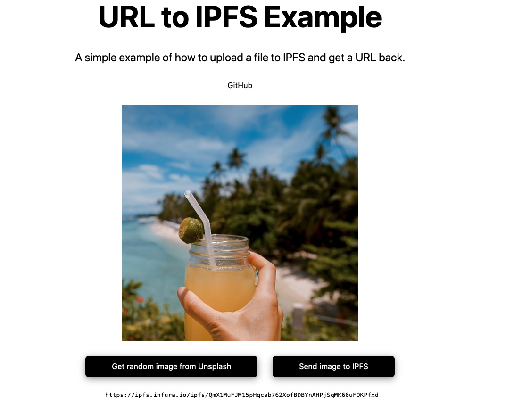

# URL to IPFS  🖼

A simple example of how to upload a file to IPFS and get a URL back.

[🔗 Demo](https://url-to-ipfs.netlify.app/)



This is a [Next.js](https://nextjs.org/) project bootstrapped with [`create-next-app`](https://github.com/vercel/next.js/tree/canary/packages/create-next-app).

## Getting Started

Clone and run:

```bash
npm run dev
# or
yarn dev
```
